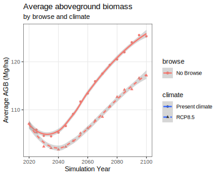

## Welcome to the Isle Royale LANDIS Project Page

Isle Royale has been the site of research into moose, wolf, and vegetation dynamics for decades. Our most recent project builds on that past work to create projections for future dynamics of vegetation, soil carbon, and moose populations into the future. The project is motivated by the uncertainties of how climate and browsing -- both hugely important processes in northern and boreal forests -- will interact to determine the future vegetation states and carbon stocks in the boreal zone. 

Moose populations at Isle Royale (courtesy NPS)
!(moose pop)[./images/Wolf-Moose_Population_2019_2.jpg]

This project is still under development, and the model results should not be interpreted as the final product of this project. Rather, we interpret them broadly as a demonstration of the model development and potential behavior of the model. 

### Background

Northern forests (boreal forest and northern hardwood forest types) play an important role in the terrestrial carbon cycle. They have a high aboveground biomass, but moreover, the soils of these forests store more carbon than most sites in the world, especially in poorly drained lowlands. Despite the importance of these ecosystems for carbon storage, they are also uniquely sensitive to climate change. Temperatures are rising faster in the boreal zone than elsewhere. Elevated temperatures may increase productivity in these some of these temperature-limited northern forests, but productivity may be reduced due to high temperatures or drought (Ruiz-Pérez and Vico 2020) or by increased disturbance (Reyer et al. 2017). At the same time, increased soil respiration may reduce soil carbon stocks (Davidson and Janssens 2006) and increased nitrogen volatilization may reduce tree growth rates. Forecasting future carbon dynamics relies upon disentangling the potential complex interactions between stand dynamics, soil dynamics, and disturbance and herbivory (Davidson and Janssens 2006, Didion et al. 2011, Chen and Frank 2020). 

**Climate change will have large effects on forests.** There will be both direct effects on productivity and establishment, and indirect effects driven by shifts in species compositional (Morin et al. 2018). The capacity for forests to adapt to climate change may be limited by site conditions such as soil characteristics, so underlying environmental gradients are expected to temper the response of forests to increased temperatures (Gustafson et al. 2021). 

**Climate change will also have large effects on soil C and N cycles.**  In addition to changes in forest productivity – and thus inputs into the soil – increased temperatures will also affect soil C and N. The interior wetlands of the USA are a vitally important carbon stock, sequestering over 500 tonnes/ha of carbon in deep organic soils (Nahlik and Fennessy 2016). Soil respiration depends on temperature – higher temperatures speed up respiration. Water is also necessary for decomposition, so changes to precipitation may alter decomposition and respiration. Water can also lead to elevated rates of denitrification in waterlogged soils, preventing respiration through nitrogen limitation (and allowing deep histisols such as peat bogs to develop). Respiration also requires nitrogen, and increased moisture and temperature may reduce soil N, thus indirectly reducing the productivity of forests.

**In this context, browsers may have unexpected effects.** Ungulate herbivores may have large effects on forest dynamics, and thus on carbon and nitrogen cycles. However, in contrast to other herbivores such as bark beetles, projections of climate and browsing interactions are limited. Browsing by moose may affect biomass of trees directly, by consuming biomass, and indirectly, by preferentially browsing on young stems of preferred species and preventing their recruitment. The direct effects of moose have been estimated at xxx, suggesting that reintroduction of wolves might increase aboveground carbon storage substantially (Wilmers and Schmitz 2016). Because moose are selective browsers, they may cause shifts in species composition towards less palatable species, and may have especially large effects on species like balsam fir (Abies balsamea) which persists in the understory at a browsable height (Charron and Hermanutz 2016). These shifts may affect aboveground and belowground carbon stocks. Moose may also have less direct effects by mediating the availability of nitrogen (Pastor et al. 1993), which is limiting in many northern soils. Given the potentially large effects of herbivore population dynamics on carbon storage, it is important to understand how they will interact with climate change. Several possibilities exist: herbivory could accelerate shifts to more heat-tolerant species or slow forest change by suppressing regeneration of replacement species, leaving stands susceptible to regeneration failure. Depending upon the productivity of future stands and the recalcitrance of future biomass, herbivory and climate change could have unexpected interactive effects on soil carbon.  

We use a simulation modeling approach to investigate the sensitivity of above- and belowground carbon stocks to climate change and herbivory. This study was conducted as Isle Royale National Park (ISRO), a highly heterogeneous archipelago with large variation in soils and vegetation. ISRO represents a mesocosm of the broader heterogeneity of northern landscapes and is a model landscape for predator-herbivore-forest interactions. Past work at the site has indicated that climate change and moose browsing will likely have interacting effects on forest structure (De Jager et al. 2020). In this study, we extend that work by considering belowground processes, including carbon sequestration and respiration and nitrogen uptake and volatilization, which will likely have emergent effects on stand structure and potential feedbacks with productivity.  

###Hypotheses
1. Carbon stocks will increase under a climate change scenario as greater forest productivity increases aboveground biomass and organic matter deposition, though this effect may be reduced by temperature-induced increases in soil respiration.
2. Herbivores will reduce soil carbon through reducing forest productivity and preferentially foraging on fast-growing hardwood species. 

## Study Site

Isle Royale, MI provides a uniquely suitable location to explore hypotheses around climate change and browsing. It is located within the ecotone between northern hardwoods and boreal forests, and is thus likely to rapidly respond to changes in climate or disturbance. It also hosts a healthy population of both moose and wolves, and has an extensive history of research into moose and vegetation interactions. It has also been the site of previous LANDIS-II modeling efforts, the foundation on which we built our current project. 

### Past research

The simulation model we use here is a continuation of work by Nathan De Jager, Matthew Duvenick, Brian Miranda, Eric Gustafson, and others. See citations:

1. De Jager, N. R., P. J. Drohan, B. M. Miranda, B. R. Sturtevant, S. L. Stout, A. A. Royo, E. J. Gustafson, and M. C. Romanski. 2017a. Simulating ungulate herbivory across forest landscapes: A browsing extension for LANDIS-II. Ecological Modelling 350:11–29.
2. De Jager, N. R., J. J. Rohweder, and M. J. Duveneck. 2020. Climate Change Is Likely to Alter Future Wolf – Moose – Forest Interactions at Isle Royale National Park, United States. Frontiers in Ecology and Evolution 8:290.
3. De Jager, N. R., J. J. Rohweder, B. R. Miranda, B. R. Sturtevant, T. J. Fox, and M. C. Romanski. 2017b. Modelling moose–forest interactions under different predation scenarios at Isle Royale National Park, USA. Ecological Applications 27:1317–1337.

## Modeling

In order to investigate potential interactions between climate change and moose browsing on ecosystem carbon stocks, we used the [LANDIS-II forest landscape model](xx landis foundation). LANDIS-II is a very flexible model framework which accommodates one of several succession extensions, which provide the main logic of tree growth, reproduction, and mortality, and multiple disturbance extensions, which might simulate processes such as fire, wind, bark beetles, or browsing by ungulate herbivores. For this project, we used: 
1. [NECN succession extension](https://github.com/LANDIS-II-Foundation/Extension-NECN-Succession). NECN tracks cohorts of trees as they grow, senesce, reproduce, and establish. These processes depend on weather, soil moisture, and soil nitrogen stocks, and the traits of the species present. NECN tracks biomass in several compartments, including four belowground C compartments.
2. [Biomass Browse extension](https://github.com/LANDIS-II-Foundation/Extension-Biomass-Browse) (De Jager et al. 2017a) We updated Biomass Browse to be compatible with NECN Succession. Biomass Browse simulates ungulate population dynamics and foraging processes. Each tree cohort supports a given amount of forage, which may be removed by browsers according to their population size, forage needs, and the habitat suitability of the neighborhood around each cell.
3. [Base Wind extension](https://github.com/LANDIS-II-Foundation/Extension-Base-Wind). 

The model was parameterized from a variety of sources, including SSURGO soils data, TreeMap initial communities data, GridMET climate data, and species parameters previously developed for [other LANDIS-II projects] (https://github.com/LANDIS-II-Foundation/Project-MN-Climate-Change-2017). For more details on parameterization see this folder in the [ISRO project page](https://github.com/LANDIS-II-Foundation/Project-Isle-Royale-2021/tree/main/Parameterization).

We ran the model for 80 simulated years under four conditions: with and without browsing, and with present climate and an RCP8.5 climate change scenario (MIROC-5). 

## Results

**These results are preliminary, and should only be interpreted as a proof-of-concept for the model behavior**

Without including browsing, climate change is projected to have large effects on the forests of Isle Royale. While under a present climate, aboveground biomass is projected to increase by ~15% as forests recover from historical harvest and disturbance, climate change limits the pace of biomass accumulation.

However, this aboveground growth comes at a cost to belowground carbon stocks. While the C cycle of the model still needs some calibration, it is apparent that higher temperatures will likely result in greater soil respiration, and this effect outweighs the influence of litter deposition from the greater tree biomass. The model projects declines in soil C even under present climate, which might indicate 1) our initial C estimates are too high, 2) the model is producing too much nitrogen, 3) the present climate has already caused a “soil carbon debt”, 4) 

In our simulated landscape, moose have several effects: they remove biomass; they kill cohorts that are heavily browsed; and they suppress growth of cohorts that have been browsed. Moose have a carrying capacity that is determined by the amount of available forage and the amount of forage needed to sustain an individual moose. 

Over the two model runs presented here that included browsing (historical climate and RCP8.5 future climate), moose carrying capacity tended to increase over time. 

